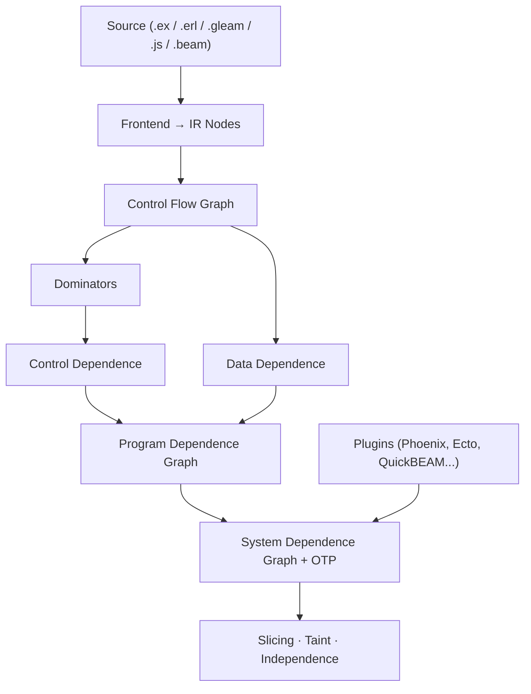

# Reach

Program dependence graph for Elixir, Erlang, Gleam, JavaScript, and TypeScript.

Reach builds a graph of **what depends on what** in your code — data
flow, control flow, and side effects. Trace any value back to its
origin, find tainted paths from user input to dangerous sinks, or check
whether two statements can be safely reordered.

Works on Elixir source, Erlang source, Gleam source, JavaScript/TypeScript
source, and compiled BEAM bytecode. Elixir 1.18+ / OTP 27+.

## Quick start

Add Reach to your dependencies:

```elixir
def deps do
  [{:reach, "~> 2.0"}]
end
```

Build a graph from any Elixir code and ask questions about it:

```elixir
graph = Reach.string_to_graph!("""
def run(input) do
  command = String.trim(input)
  System.cmd("sh", ["-c", command])
end
""")
```

Find what affects a specific call — trace the `System.cmd` back to its origins:

```elixir
[cmd_call] = Reach.nodes(graph, type: :call, module: System, function: :cmd)
Reach.backward_slice(graph, cmd_call.id)
```

Check whether user input reaches a dangerous sink without sanitization:

```elixir
Reach.taint_analysis(graph,
  sources: [type: :call, function: :params],
  sinks: [type: :call, module: System, function: :cmd],
  sanitizers: [type: :call, function: :sanitize]
)
```

Or check whether two statements can be safely reordered:

```elixir
Reach.independent?(graph, node_a.id, node_b.id)
```

## Interactive visualization

```bash
mix reach lib/my_app/accounts.ex lib/my_app/auth.ex
```

Generates a self-contained HTML report with three tabs:

- **Control Flow** — expression-level graph with branch/converge edges,
  syntax-highlighted source, if/case/unless detection
- **Call Graph** — function calls grouped by module
- **Data Flow** — variable def→use chains within functions

Fully offline — everything embedded in a single HTML file.

Requires optional deps:

```elixir
{:jason, "~> 1.0"},
{:makeup, "~> 1.0"},         # syntax highlighting
{:makeup_elixir, "~> 1.0"}
```


## CLI tools

Reach has six primary entrypoints: the HTML report task (`mix reach`) plus five
canonical analysis tasks. Analysis commands support `--format text` (default,
colored), `json`, and `oneline` where applicable.

### Project map

```bash
# Bird's-eye overview: modules, hotspots, coupling, effect boundaries
mix reach.map

# Focused summaries
mix reach.map --modules --sort complexity
mix reach.map --hotspots --top 10
mix reach.map --coupling
mix reach.map --data
```

### Target inspection

```bash
# Agent-readable context for one function/file/line
mix reach.inspect MyApp.Accounts.register/2 --context

# Expand capped text sections when you need more detail
mix reach.inspect MyApp.Accounts.register/2 --context --limit 100
mix reach.inspect MyApp.Accounts.register/2 --context --all

# What calls this and what does it call?
mix reach.inspect MyApp.Accounts.register/2 --deps

# What breaks if I change this function?
mix reach.inspect MyApp.Accounts.register/2 --impact

# Target-local data-flow view or terminal graph
mix reach.inspect MyApp.Accounts.register/2 --data
mix reach.inspect MyApp.Accounts.register/2 --graph

# Explain why one target reaches or depends on another
mix reach.inspect MyApp.Accounts.register/2 --why MyApp.Mailer.deliver/1
```

### Data flow and slicing

```bash
# Does user input reach the database?
mix reach.trace --from conn.params --to Repo
mix reach.trace --from conn.params --to Repo --limit 25

# Where is this variable defined and used?
mix reach.trace --variable user

# Expand capped text output, or use JSON for machine-readable full output
mix reach.trace --variable user --limit 100
mix reach.trace --variable user --all

# What code affects this line?
mix reach.trace --backward lib/my_app/accounts.ex:45

# Where does this value flow to?
mix reach.trace --forward lib/my_app/accounts.ex:45
```

### OTP and process analysis

```bash
# GenServer state machines, ETS coupling, missing handlers
mix reach.otp

# Concurrency-specific view
mix reach.otp --concurrency
```

### Structural checks

```bash
# Architecture policy from .reach.exs
# See examples/reach.exs for a starting point.
mix reach.check --arch

# Changed files and configured test hints
mix reach.check --changed

# Unused pure expressions and graph/effect/data-flow smells
# Includes loose map contracts such as map["id"] || map[:id]
mix reach.check --dead-code
mix reach.check --smells

# Advisory refactoring candidates with proof requirements
mix reach.check --candidates --top 10
```

Older task names have been removed in Reach 2.0 and now fail fast with migration instructions. Use the canonical commands:

| Deprecated | Use instead |
|---|---|
| `mix reach.modules` | `mix reach.map --modules` |
| `mix reach.coupling` | `mix reach.map --coupling` |
| `mix reach.hotspots` | `mix reach.map --hotspots` |
| `mix reach.depth` | `mix reach.map --depth` |
| `mix reach.effects` | `mix reach.map --effects` |
| `mix reach.boundaries` | `mix reach.map --boundaries` |
| `mix reach.xref` | `mix reach.map --data` |
| `mix reach.deps TARGET` | `mix reach.inspect TARGET --deps` |
| `mix reach.impact TARGET` | `mix reach.inspect TARGET --impact` |
| `mix reach.slice TARGET` | `mix reach.trace TARGET` |
| `mix reach.flow ...` | `mix reach.trace ...` |
| `mix reach.dead_code` | `mix reach.check --dead-code` |
| `mix reach.smell` | `mix reach.check --smells` |
| `mix reach.graph TARGET` | `mix reach.inspect TARGET --graph` |
| `mix reach.graph TARGET --call-graph` | `mix reach.inspect TARGET --call-graph` |
| `mix reach.concurrency` | `mix reach.otp --concurrency` |

JSON output uses canonical `command` envelopes. `.reach.exs` architecture policy is documented in [`CONFIG.md`](CONFIG.md).

Text output is intentionally concise for large projects. When a section reports omitted rows, use `--limit N` to expand it, `--all` to print the full text view, or `--format json` for complete machine-readable output. This currently applies to `mix reach.trace` and `mix reach.inspect --context`.

### Terminal graphs

With the optional `boxart` dependency, render graphs directly in the terminal:

```bash
mix reach.inspect MyApp.Server.handle_call/3 --graph
mix reach.inspect MyApp.Server.handle_call/3 --impact --graph
mix reach.inspect MyApp.Server.handle_call/3 --data --graph
```

Requires `{:boxart, "~> 0.3.3"}` in your deps.

## Core workflows

### Slicing

```elixir
graph = Reach.file_to_graph!("lib/accounts.ex")

Reach.backward_slice(graph, node_id)   # what affects this expression?
Reach.forward_slice(graph, node_id)    # what does this expression affect?
Reach.chop(graph, source_id, sink_id)  # all paths from A to B
```

### Taint analysis

```elixir
Reach.taint_analysis(graph,
  sources: [type: :call, function: :params],
  sinks: [type: :call, module: Repo, function: :query],
  sanitizers: [type: :call, function: :sanitize]
)
#=> [%{source: node, sink: node, path: [node_id, ...], sanitized: boolean}]

# Predicates work too
Reach.taint_analysis(graph,
  sources: &(&1.meta[:function] in [:params, :body_params]),
  sinks: [type: :call, module: System, function: :cmd]
)
```

### Independence and reordering

```elixir
# Safe to reorder?
Reach.independent?(graph, id_a, id_b)

# Data flow between expressions
Reach.data_flows?(graph, source_id, sink_id)
Reach.depends?(graph, id_a, id_b)
```

### Dead code

```elixir
for node <- Reach.dead_code(graph) do
  IO.warn("#{node.source_span.start_line}: unused #{node.type}")
end
```

## Building a graph

```elixir
# Elixir source
graph = Reach.file_to_graph!("lib/my_module.ex")
{:ok, graph} = Reach.string_to_graph("def foo(x), do: x + 1")

# Erlang source (auto-detected by extension)
{:ok, graph} = Reach.file_to_graph("src/my_module.erl")

# JavaScript / TypeScript source (requires quickbeam)
{:ok, graph} = Reach.file_to_graph("assets/app.ts")

# Pre-parsed AST (for Credo/ExDNA integration)
{:ok, graph} = Reach.ast_to_graph(ast)

# Gleam source (requires glance parser)
{:ok, graph} = Reach.file_to_graph("src/app.gleam")

# Compiled BEAM bytecode — sees macro-expanded code
{:ok, graph} = Reach.module_to_graph(MyApp.Accounts)
```

## JavaScript / TypeScript support

Reach can analyze JavaScript and TypeScript files, including
cross-language data flow for projects using QuickBEAM.

```elixir
# Parse JS/TS files
{:ok, nodes} = Reach.Frontend.JavaScript.parse_file("assets/app.ts")

# Cross-language analysis with the QuickBEAM plugin
graph = Reach.string_to_graph!(elixir_source, plugins: [Reach.Plugins.QuickBEAM])
```

The QuickBEAM plugin automatically detects embedded JS in
`QuickBEAM.eval` calls and creates cross-language edges:

| Edge | Meaning |
|------|---------|
| `:js_eval` | Elixir eval call → JS function definitions |
| `{:js_call, name}` | `QuickBEAM.call(rt, name)` → JS named function |
| `{:beam_call, name}` | JS `Beam.callSync(name)` → Elixir handler |

Requires `{:quickbeam, "~> 0.10", optional: true}` in your deps.
TypeScript is stripped via OXC, ES module syntax handled automatically.

## Gleam support

```bash
mix reach src/app.gleam
```

Requires the [glance](https://github.com/lpil/glance) parser:

```bash
git clone https://github.com/lpil/glance /tmp/glance
cd /tmp/glance && gleam build --target erlang
```

## Multi-file project analysis

```elixir
project = Reach.Project.from_mix_project()
# or: Reach.Project.from_glob("lib/**/*.ex")

# Cross-module taint analysis
Reach.Project.taint_analysis(project,
  sources: [type: :call, function: :params],
  sinks: [type: :call, module: System, function: :cmd]
)
```

## What makes Reach different

- **Four frontends** — Elixir source, Erlang source, Gleam source, BEAM
  bytecode. The BEAM frontend sees `use GenServer` callbacks, macro-expanded
  code, and generated functions invisible to source analysis.
- **OTP-aware** — GenServer state threading, message content flow,
  ETS dependencies, process dictionary tracking, call/reply pairing.
- **Concurrency edges** — `Process.monitor` → `:DOWN` handlers,
  `trap_exit` → `:EXIT` handlers, `Task.async` → `Task.await`,
  supervisor child startup ordering.
- **Interprocedural** — context-sensitive slicing (Horwitz-Reps-Binkley),
  cross-module call resolution, dependency summaries for external packages.
- **Effect classification** — knows which functions are pure, which
  do I/O, and which send messages. Covers Enum, Map, String, and 30+
  more modules out of the box.

## Nodes and edges

Every expression in the analyzed code becomes a node:

```elixir
Reach.nodes(graph)
Reach.nodes(graph, type: :call, module: Repo, function: :insert, arity: 1)

node.type        #=> :call
node.meta        #=> %{module: Repo, function: :insert, arity: 1}
node.source_span #=> %{file: "lib/accounts.ex", start_line: 12, ...}
```

Edges capture dependencies:

| Label | Meaning |
|-------|---------|
| `{:data, var}` | Data flows through variable |
| `:containment` | Parent depends on child sub-expression |
| `{:control, label}` | Controlled by branch condition |
| `:call` | Call site to callee |
| `:parameter_in` / `:parameter_out` | Argument/return flow |
| `:summary` | Parameter flows to return value |
| `:state_read` / `:state_pass` | GenServer state flow |
| `{:ets_dep, table}` | ETS write → read |
| `:monitor_down` / `:trap_exit` / `:link_exit` | Crash propagation |
| `:task_result` | Task.async → Task.await |
| `{:message_content, tag}` | Message payload flow |
| `:js_eval` | Elixir eval → JS function |
| `{:js_call, name}` | Elixir call → JS named function |
| `{:beam_call, name}` | JS Beam.callSync → Elixir handler |

## Architecture



Reach builds a **program dependence graph** (PDG) — a directed graph where
nodes are expressions and edges are data/control dependencies. Multiple
function PDGs are connected into a **system dependence graph** (SDG) via
call/summary edges for interprocedural analysis.

## Validation

Reach 2.0's canonical CLI was validated across 20 real Elixir codebases,
including Jido projects, Livebook, Plausible Analytics, Supabase Realtime, Ash,
Absinthe, Surface, Nerves, Broadway, and Commanded. The validation covered every
canonical command family, JSON output, graph rendering, architecture checks,
changed-code risk, advisory candidates, OTP/concurrency analysis, and
removed-command migration errors.

Project-wide commands intentionally trade speed for breadth. For large codebases,
start with `--top`, focused section flags such as `--hotspots` or `--data`, or
target-specific `mix reach.inspect` commands.

## References

- Ferrante, Ottenstein, Warren — *The Program Dependence Graph and Its Use in Optimization* (1987)
- Horwitz, Reps, Binkley — *Interprocedural Slicing Using Dependence Graphs* (1990)
- Silva, Tamarit, Tomás — *System Dependence Graphs for Erlang Programs* (2012)
- Cooper, Harvey, Kennedy — *A Simple, Fast Dominance Algorithm* (2001)

## License

[MIT](LICENSE)
