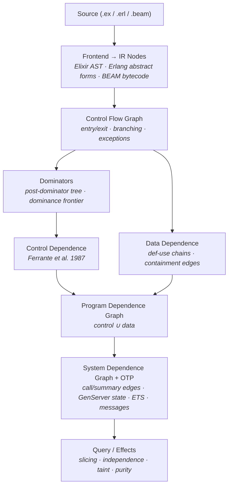

# ExPDG

Program dependence graph for Elixir and Erlang.

ExPDG builds a graph that captures **what depends on what** in a program —
which expressions produce values consumed by others (data dependence), and
which expressions control whether others execute (control dependence). Once
you have that graph, questions like "what affects this line?", "can these two
statements be reordered?", and "does user input reach this sink?" become
graph queries instead of bespoke analyses.

## What it enables

**Slicing** — given any expression, find everything that affects it (backward
slice) or everything it affects (forward slice):

```elixir
graph = ExPDG.file_to_graph!("lib/accounts.ex")
ExPDG.backward_slice(graph, node_id)   # what does this depend on?
ExPDG.forward_slice(graph, node_id)    # what does this influence?
```

**Independence** — can two expressions be safely reordered? ExPDG checks data
flow, control dependencies, and side effects:

```elixir
ExPDG.independent?(graph, id_a, id_b)  #=> true — safe to reorder
```

**Taint analysis** — does data flow from a source to a sink, and does it pass
through sanitization?

```elixir
ExPDG.data_flows?(graph, input_id, query_id)
ExPDG.passes_through?(graph, input_id, query_id, &sanitized?/1)
```

**Effect classification** — is a call pure, does it perform IO, write to ETS,
send messages?

```elixir
ExPDG.pure?(node)                 #=> true
ExPDG.classify_effect(node)       #=> :io
```

**Clone detection** — canonical ordering of independent statements for
reordering-equivalent clone detection
([ExDNA](https://github.com/dannote/ex_dna) integration):

```elixir
ExPDG.canonical_order(graph, block_id)
```

**OTP analysis** — GenServer state threading, ETS read/write dependencies,
message ordering:

```elixir
edges = ExPDG.edges(graph)
Enum.filter(edges, &(&1.label == :state_read))    # state flow
Enum.filter(edges, &match?({:ets_dep, _}, &1.label))  # ETS deps
```

## Installation

```elixir
def deps do
  [{:ex_pdg, "~> 0.1"}]
end
```

## Quick start

```elixir
# From source string
{:ok, graph} = ExPDG.string_to_graph("""
def process(user, params) do
  changeset = User.changeset(user, params)
  if changeset.valid? do
    Repo.update(changeset)
  else
    {:error, changeset}
  end
end
""")

# From file (auto-detects .ex/.erl)
{:ok, graph} = ExPDG.file_to_graph("lib/accounts.ex")

# From Erlang source
{:ok, graph} = ExPDG.string_to_graph(source, language: :erlang)

# From pre-parsed AST (useful for Credo/ExDNA integration)
{:ok, ast} = Code.string_to_quoted(source)
{:ok, graph} = ExPDG.ast_to_graph(ast)

# From compiled BEAM bytecode (sees macro-expanded code)
{:ok, graph} = ExPDG.module_to_graph(MyApp.Accounts)
```

## Querying the graph

### Finding nodes

```elixir
# All nodes
ExPDG.nodes(graph)

# Filter by type
ExPDG.nodes(graph, type: :call)
ExPDG.nodes(graph, type: :call, module: Repo)
ExPDG.nodes(graph, type: :call, module: Repo, function: :insert)

# Get a specific node
node = ExPDG.node(graph, node_id)
node.type        #=> :call
node.meta        #=> %{module: Repo, function: :insert, arity: 1}
node.source_span #=> %{file: "lib/accounts.ex", start_line: 12, ...}
node.children    #=> [%ExPDG.IR.Node{...}, ...]
```

### Slicing

```elixir
# What affects this expression?
ExPDG.backward_slice(graph, node_id)
#=> [4, 7, 12, ...]  — list of node IDs

# What does this expression affect?
ExPDG.forward_slice(graph, node_id)

# How does A influence B? (nodes on all paths between them)
ExPDG.chop(graph, source_id, sink_id)
```

### Data flow

```elixir
# Does data flow from source to sink?
ExPDG.data_flows?(graph, source_id, sink_id)

# Does the path pass through a sanitizer?
ExPDG.passes_through?(graph, source_id, sink_id, fn node ->
  node.type == :call and node.meta[:function] == :sanitize
end)

# Are two nodes connected by any dependence?
ExPDG.depends?(graph, id_a, id_b)

# Does this node's value get used anywhere?
ExPDG.has_dependents?(graph, node_id)
```

### Independence

```elixir
# Can these two expressions be safely reordered?
# Checks: no data flow between them, same control conditions,
# no conflicting side effects
ExPDG.independent?(graph, id_a, id_b)
```

### Effects

```elixir
ExPDG.pure?(node)            #=> true/false
ExPDG.classify_effect(node)  #=> :pure | :io | :read | :write | :send | ...
```

Pure function database covers `Enum`, `Map`, `List`, `String`, `Keyword`,
`Tuple`, `Integer`, `Float`, `Atom`, `MapSet`, `Range`, `Regex`, `URI`,
`Path`, `Base`, `Bitwise`, and Erlang equivalents (`:lists`, `:maps`,
`:string`, `:math`, etc.). `Enum.each` is correctly classified as impure.

### Dependencies

```elixir
# What controls whether this node executes?
ExPDG.control_deps(graph, node_id)
#=> [{condition_node_id, {:control, :true_branch}}, ...]

# What data does this node depend on?
ExPDG.data_deps(graph, node_id)
#=> [{definition_node_id, :variable_name}, ...]
```

### Interprocedural

```elixir
# Per-function PDG
ExPDG.function_graph(graph, {MyModule, :my_function, 2})

# Context-sensitive slice (Horwitz-Reps-Binkley two-phase algorithm)
ExPDG.context_sensitive_slice(graph, node_id)

# Call graph
cg = ExPDG.call_graph(graph)
Graph.vertices(cg)  #=> [{MyModule, :foo, 1}, {MyModule, :bar, 2}, ...]
```

### Export

```elixir
{:ok, dot} = ExPDG.to_dot(graph)
File.write!("graph.dot", dot)
# dot -Tpng graph.dot -o graph.png
```

## Three frontends

| Frontend | Entry point | What it sees |
|----------|-------------|-------------|
| **Elixir source** | `string_to_graph/2`, `file_to_graph/2` | Source-level AST, pre-expansion |
| **Erlang source** | `string_to_graph(s, language: :erlang)`, `file_to_graph("mod.erl")` | Erlang abstract forms via `:epp` |
| **BEAM bytecode** | `module_to_graph/2`, `compiled_to_graph/2` | Macro-expanded code, `use` callbacks, everything the compiler sees |

The BEAM frontend is useful when you need to analyze code injected by macros:

```elixir
# Source-level: sees init/1 and handle_call/3 only
{:ok, g1} = ExPDG.string_to_graph(genserver_source)

# BEAM-level: also sees child_spec/1, terminate/2, handle_info/2
# injected by `use GenServer`
{:ok, g2} = ExPDG.compiled_to_graph(genserver_source)
```

## OTP awareness

ExPDG understands OTP patterns as first-class dependence structures:

- **GenServer state threading** — `state_read` edges from callback parameter
  to uses, `state_pass` edges between consecutive callback returns
- **ETS dependencies** — `ets_dep` edges between writes and reads on the same
  table, with table name tracking
- **Process dictionary** — `pdict_dep` edges between `Process.put` and
  `Process.get` on the same key
- **Message ordering** — `message_order` edges between sequential sends to
  the same pid

## Architecture



## Validated on real projects

740 files across 7 projects, zero crashes:

| Project | Files | Functions | IR Nodes | Edges |
|---------|-------|-----------|----------|-------|
| Phoenix | 74 | 1,405 | 46,900 | 35,801 |
| Absinthe | 282 | 2,276 | 69,662 | 32,029 |
| Keila | 190 | 1,292 | 46,006 | 25,781 |
| Oban | 64 | 795 | 31,097 | 17,544 |
| Livebook | 72 | 940 | 22,588 | 13,364 |

## References

- Ferrante, Ottenstein, Warren — "The Program Dependence Graph and Its Use in
  Optimization" (1987)
- Horwitz, Reps, Binkley — "Interprocedural Slicing Using Dependence Graphs"
  (1990)
- Silva, Tamarit, Tomás — "System Dependence Graphs for Erlang Programs" (2012)
- Cooper, Harvey, Kennedy — "A Simple, Fast Dominance Algorithm" (2001)

## License

[MIT](LICENSE)
