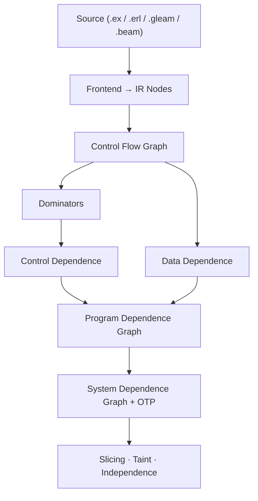

# Reach

Program dependence graph for Elixir, Erlang, and Gleam.

Reach builds a graph of **what depends on what** in your code — data
flow, control flow, and side effects. Trace any value back to its
origin, find tainted paths from user input to dangerous sinks, or check
whether two statements can be safely reordered.

Works on Elixir source, Erlang source, Gleam source, and compiled BEAM
bytecode. Elixir 1.18+ / OTP 27+.

## Quick start

Add Reach to your dependencies:

```elixir
def deps do
  [{:reach, "~> 1.2"}]
end
```

Build a graph from any Elixir code and ask questions about it:

```elixir
graph = Reach.string_to_graph!("""
def run(input) do
  command = String.trim(input)
  System.cmd("sh", ["-c", command])
end
""")
```

Find what affects a specific call — trace the `System.cmd` back to its origins:

```elixir
[cmd_call] = Reach.nodes(graph, type: :call, module: System, function: :cmd)
Reach.backward_slice(graph, cmd_call.id)
```

Check whether user input reaches a dangerous sink without sanitization:

```elixir
Reach.taint_analysis(graph,
  sources: [type: :call, function: :params],
  sinks: [type: :call, module: System, function: :cmd],
  sanitizers: [type: :call, function: :sanitize]
)
```

Or check whether two statements can be safely reordered:

```elixir
Reach.independent?(graph, node_a.id, node_b.id)
```
## Interactive visualization

```bash
mix reach lib/my_app/accounts.ex lib/my_app/auth.ex
```

Generates a self-contained HTML report with three tabs:

- **Control Flow** — expression-level graph with branch/converge edges,
  syntax-highlighted source, if/case/unless detection
- **Call Graph** — function calls grouped by module
- **Data Flow** — variable def→use chains within functions

Fully offline — everything embedded in a single HTML file.

Requires optional deps:

```elixir
{:jason, "~> 1.0"},
{:makeup, "~> 1.0"},         # syntax highlighting
{:makeup_elixir, "~> 1.0"}
```


## CLI tools

Eight mix tasks for code analysis. All support `--format text` (default,
colored), `json`, and `oneline`.

### Codebase overview

```bash
# Module inventory sorted by complexity
mix reach.modules --sort complexity

# Dead code detection
mix reach.dead_code
```

### Function analysis

```bash
# What calls this and what does it call?
mix reach.deps MyApp.Accounts.register/2

# What breaks if I change this function?
mix reach.impact MyApp.Accounts.register/2
```

### Data flow

```bash
# Does user input reach the database?
mix reach.flow --from conn.params --to Repo

# Where is this variable defined and used?
mix reach.flow --variable user

# What code affects this line?
mix reach.slice lib/my_app/accounts.ex:45

# Where does this value flow to?
mix reach.slice --forward lib/my_app/accounts.ex:45
```

### OTP and performance

```bash
# GenServer state machines, ETS coupling, missing handlers
mix reach.otp

# Cross-function redundant computations, suboptimal Enum patterns
mix reach.smell
```


### Terminal graphs

With the optional `boxart` dependency, render graphs directly in the terminal:

```bash
# Control flow graph with source code
mix reach.graph MyApp.Server.handle_call/3

# Call graph as a tree
mix reach.graph MyApp.Server.handle_call/3 --call-graph

# Any command with --graph
mix reach.deps MyApp.Accounts.register/2 --graph
mix reach.impact MyApp.Accounts.register/2 --graph
mix reach.modules --graph
mix reach.otp --graph
```

Requires `{:boxart, "~> 0.3"}` in your deps.

## Core workflows

### Slicing

```elixir
graph = Reach.file_to_graph!("lib/accounts.ex")

Reach.backward_slice(graph, node_id)   # what affects this expression?
Reach.forward_slice(graph, node_id)    # what does this expression affect?
Reach.chop(graph, source_id, sink_id)  # all paths from A to B
```

### Taint analysis

```elixir
Reach.taint_analysis(graph,
  sources: [type: :call, function: :params],
  sinks: [type: :call, module: Repo, function: :query],
  sanitizers: [type: :call, function: :sanitize]
)
#=> [%{source: node, sink: node, path: [node_id, ...], sanitized: boolean}]

# Predicates work too
Reach.taint_analysis(graph,
  sources: &(&1.meta[:function] in [:params, :body_params]),
  sinks: [type: :call, module: System, function: :cmd]
)
```

### Independence and reordering

```elixir
# Safe to reorder?
Reach.independent?(graph, id_a, id_b)

# Data flow between expressions
Reach.data_flows?(graph, source_id, sink_id)
Reach.depends?(graph, id_a, id_b)
```

### Dead code

```elixir
for node <- Reach.dead_code(graph) do
  IO.warn("#{node.source_span.start_line}: unused #{node.type}")
end
```

## Building a graph

```elixir
# Elixir source
graph = Reach.file_to_graph!("lib/my_module.ex")
{:ok, graph} = Reach.string_to_graph("def foo(x), do: x + 1")

# Erlang source (auto-detected by extension)
{:ok, graph} = Reach.file_to_graph("src/my_module.erl")

# Pre-parsed AST (for Credo/ExDNA integration)
{:ok, graph} = Reach.ast_to_graph(ast)

# Gleam source (requires glance parser)
{:ok, graph} = Reach.file_to_graph("src/app.gleam")

# Compiled BEAM bytecode — sees macro-expanded code
{:ok, graph} = Reach.module_to_graph(MyApp.Accounts)
```

## Gleam support

```bash
mix reach src/app.gleam
```

Requires the [glance](https://github.com/lpil/glance) parser:

```bash
git clone https://github.com/lpil/glance /tmp/glance
cd /tmp/glance && gleam build --target erlang
```

## Multi-file project analysis

```elixir
project = Reach.Project.from_mix_project()
# or: Reach.Project.from_glob("lib/**/*.ex")

# Cross-module taint analysis
Reach.Project.taint_analysis(project,
  sources: [type: :call, function: :params],
  sinks: [type: :call, module: System, function: :cmd]
)
```

## What makes Reach different

- **Four frontends** — Elixir source, Erlang source, Gleam source, BEAM
  bytecode. The BEAM frontend sees `use GenServer` callbacks, macro-expanded
  code, and generated functions invisible to source analysis.
- **OTP-aware** — GenServer state threading, message content flow,
  ETS dependencies, process dictionary tracking, call/reply pairing.
- **Concurrency edges** — `Process.monitor` → `:DOWN` handlers,
  `trap_exit` → `:EXIT` handlers, `Task.async` → `Task.await`,
  supervisor child startup ordering.
- **Interprocedural** — context-sensitive slicing (Horwitz-Reps-Binkley),
  cross-module call resolution, dependency summaries for external packages.
- **Effect classification** — knows which functions are pure, which
  do I/O, and which send messages. Covers Enum, Map, String, and 30+
  more modules out of the box.

## Nodes and edges

Every expression in the analyzed code becomes a node:

```elixir
Reach.nodes(graph)
Reach.nodes(graph, type: :call, module: Repo, function: :insert, arity: 1)

node.type        #=> :call
node.meta        #=> %{module: Repo, function: :insert, arity: 1}
node.source_span #=> %{file: "lib/accounts.ex", start_line: 12, ...}
```

Edges capture dependencies:

| Label | Meaning |
|-------|---------|
| `{:data, var}` | Data flows through variable |
| `:containment` | Parent depends on child sub-expression |
| `{:control, label}` | Controlled by branch condition |
| `:call` | Call site to callee |
| `:parameter_in` / `:parameter_out` | Argument/return flow |
| `:summary` | Parameter flows to return value |
| `:state_read` / `:state_pass` | GenServer state flow |
| `{:ets_dep, table}` | ETS write → read |
| `:monitor_down` / `:trap_exit` / `:link_exit` | Crash propagation |
| `:task_result` | Task.async → Task.await |
| `{:message_content, tag}` | Message payload flow |

## Architecture



Reach builds a **program dependence graph** (PDG) — a directed graph where
nodes are expressions and edges are data/control dependencies. Multiple
function PDGs are connected into a **system dependence graph** (SDG) via
call/summary edges for interprocedural analysis.

## Performance

Single-threaded, Apple M1 Pro:

| Project | Files | Time |
|---------|-------|------|
| Livebook | 72 | 160ms |
| Oban | 64 | 195ms |
| Keila | 190 | 282ms |
| Phoenix | 74 | 333ms |
| Absinthe | 282 | 375ms |

740 files, zero crashes.

## References

- Ferrante, Ottenstein, Warren — *The Program Dependence Graph and Its Use in Optimization* (1987)
- Horwitz, Reps, Binkley — *Interprocedural Slicing Using Dependence Graphs* (1990)
- Silva, Tamarit, Tomás — *System Dependence Graphs for Erlang Programs* (2012)
- Cooper, Harvey, Kennedy — *A Simple, Fast Dominance Algorithm* (2001)

## License

[MIT](LICENSE)
